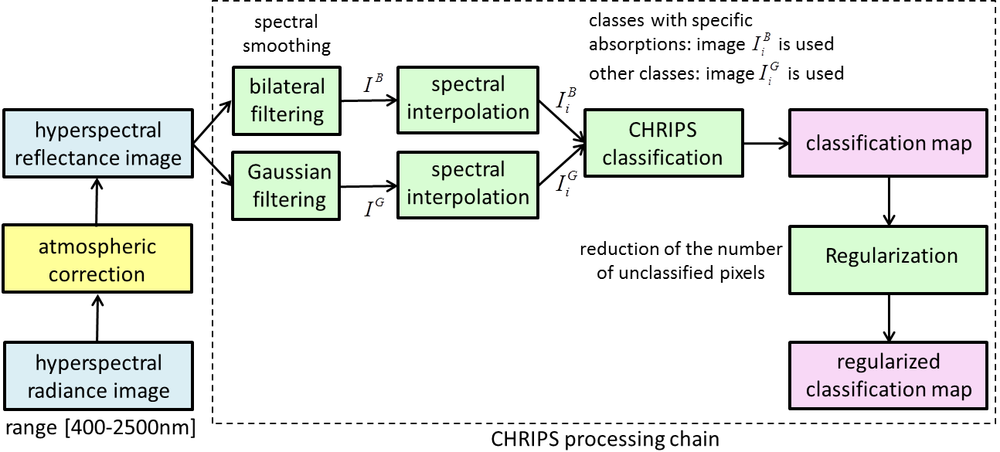
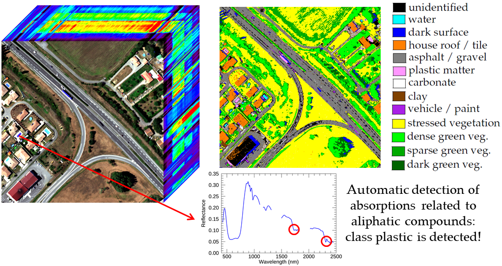

## Classification of Hyperspectral Reflectance Images With Physical and Statistical Criteria : CHRIPS method (2020)

 
CHRIPS is a hierarchical unsupervised classification method that can be applied on hyperspectral reflectance images covering the spectral range [400–2500 nm]. For each class, a dedicated detection method exploits specific spectral properties (specific absorptions or shape features) or spectral indices. CHRIPS method identifies fourteen different classes that are gathered into four groups: dark surfaces, materials with specific absorptions, vegetation and other types of surfaces (scattering surfaces). The class assignment is hierarchical: classes are investigated one after the other in a given order. Class order is defined by the complexity of class characterization. It reduces the number of criteria needed to characterize each class. 

 

The ordered classes are given by the following list:
*  Dark surface
   * dark green vegetation
   * water
   * unidentified dark surface (water, shadows...)
*  Material with specific absorptions
   * plastic matter (aliphatic)
   * plastic matter (aromatic)
   * carbonate
   * clay soil
*  Vegetation
   * dense green vegetation
   * sparse green vegetation
   * stressed vegetation
*  Classes with dedicated indices
   * house roof/tile/iron oxide
   * asphalt
   * vehicle/paint/metal surface
   * non-carbonated gravel
*  Unidentified (0)

 
First of all, dark surfaces are identified: they are defined as surfaces for which reflectances are very low in the SWIR range. They are also processed first because corresponding spectra are very noisy and may check sometimes criteria of other classes. Secondly, materials with specific absorptions are identified. They correspond to materials that present very local minima on spectral reflectance due to electronic or vibrational processes. For instance, reflectances of surfaces containing clay have a local minimum around 2200 nm. Thirdly, vegetation classes are identified. They are characterized with dedicated indices that highlight some bio-physical properties (chlorophyll content, water content, stress, etc.) or geometric features (local maxima, etc.). 

 

 
In the end, the remaining classes are more complex to describe: they do not exhibit any physical or observable features that make it possible to characterize them. It is why they are processed after all other classes. We propose to compute some combinations of indices in the same way as vegetation indices and that would be dedicated to a given class. The classification process CHRIPS is based on a sequential tree of detection. Each class is characterized with a few criteria and classes are ordered. The process of classification is as follows. For each pixel, all criteria associated to class 1 are assessed. If all criteria are true, the pixel is considered as belonging to class 1 and the process ends. If at least one criterion is false, the pixel does not belong to class 1, criteria of class 2 are then assessed. The same process is conducted class after class. If at the end, the pixel does not belong to any of the defined classes, it is considered as unidentified. CHRIPS includes a reject class that reduces the risk of misclassification. In general, the reject class includes spectra that do not correspond to any class of CHRIPS or correspond to mixed spectra. Depending on spatial resolution, many pixels may contain different materials or surfaces and then a unique label could not be easily assigned to them (except in the case where a given class has a large majority). The full processing chain of CHRIPS is presented below: 

 

  

 
Processing chain of CHRIPS. Atmospheric correction is not included: the input of the processing chain is a reflectance image. The spectral range of input image needs to be [400–2500 nm]: CHRIPS characterizes each class with criteria that use spectral bands in both VNIR and SWIR ranges. 

 

 
More details are provided in the paper: 
Alakian, A.; Achard, V. Classification of Hyperspectral Reflectance Images With Physical and Statistical Criteria. Remote Sens. 2020, 12, 2335. https://doi.org/10.3390/rs12142335

 

 
Three pre-processing can be applied to the hyperspectral image before using the CHRIPS method. The first pre-processing aims at reducing the existing noise on the spectral reflectances by applying a filtering to them: a bilateral filtering for the classes with specific absorptions and a Gaussian filtering for the other classes. The second pre-processing is the spectral interpolation according to the spectral bands used by CHRIPS method. A third pre-processing consists in retaining only spectral bands that are used by CHRIPS. At the output of the CHRIPS method, a spatial regularization step is applied to possibly assign a class to unclassified pixels. CHRIPS is a purely spectral method. However, the regularization method takes into account the neighborhood of the pixels, which introduces a spatial context. 
Important: CHRIPS exploits the whole spectral range [400–2500 nm]. It cannot be effectively applied to images restricted to the VNIR range [400–1000 nm] or SWIR range [1000–2500 nm]. However, as the classes exploiting specific absorptions focus only on the SWIR domain, they could be well identified in the case where only SWIR data is available. 

 

CHRIPS presents several advantages: 
* By construction, this method indicates the type of material (a class is not a simple number) as opposed to traditional unsupervised methods. 
* No parameterization is required from the user. However, some thresholds can be modified according to its needs, such as the thresholds on the NDVI index allowing to characterize the vegetation. 
* A class is assigned to a pixel if all the criteria associated with the class are true. If a pixel does not meet all the criteria for at least one class, it will be considered as unidentified : it is preferred not to classify rather than risking a wrong assignment. 

  

## Classification results with standard thresholds (no tuning of parameters)

[AVIRIS-NG images](visu_images_AVIRIS_NG.md)

[HYSPEX images](visu_images_HYSPEX.md)

[AISAFENIX images](visu_images_AISAFENIX.md)

[HYMAP images](visu_images_HYMAP.md)

[PRISMA images](visu_images_PRISMA.md)
