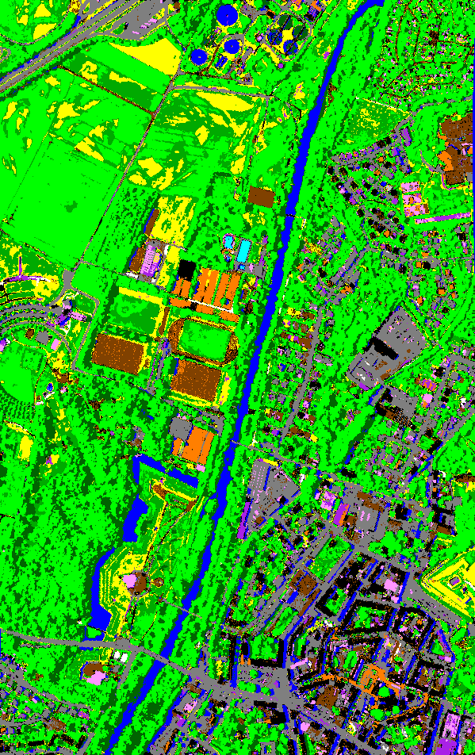
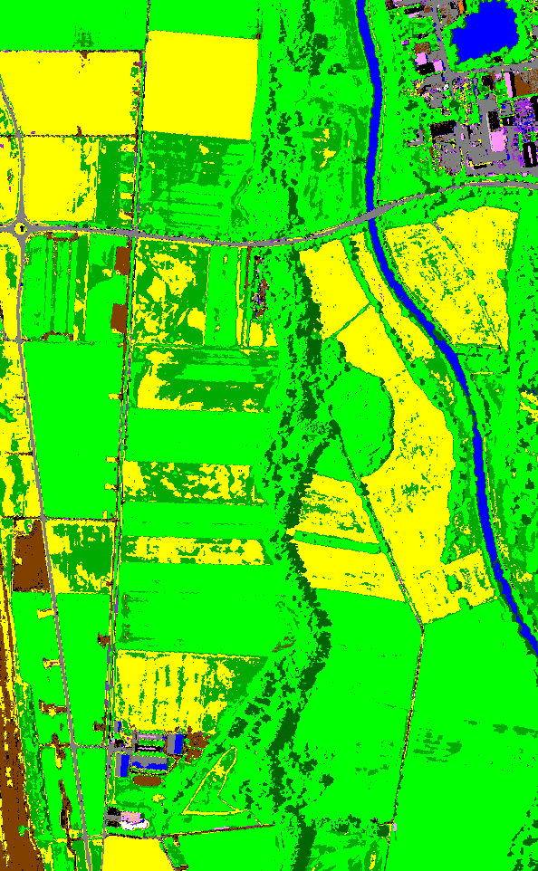
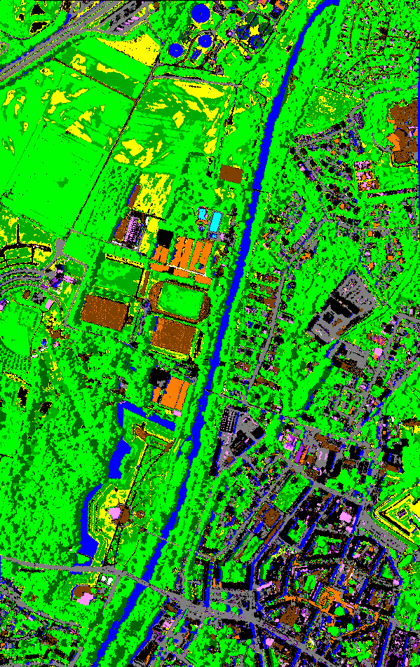

## classification of hyperspectral reflectance imags : CHRIPS (2020)

A classification method of hyperspectral reflectance images named CHRIPS (Classification of Hyperspectral Reflectance Images with Physical and Statistical criteria) is presented. This method aims at classifying each pixel from a given set of thirteen classes: unidentified dark surface, water, plastic matter, carbonate, clay, vegetation (dark green, dense green, sparse green, stressed), house roof / tile, asphalt, vehicle / paint / metal surface and non-carbonated gravel. Each class is
characterized by physical criteria (detection of specific absorptions or shape features) or statistical criteria (use of dedicated spectral indices) over spectral reflectance. CHRIPS input is a hyperspectral reflectance image covering the spectral range \[400-2500nm\]. The presented method has four advantages, namely: i) is robust in transfer, class identification is based on criteria that are not very sensitive to sensor type; ii) does not require training, criteria are pre-defined; iii) includes a reject class, this class reduces misclassifications; iv) high precision and recall, F1 score is generally above 0.9 in our test. As the number of classes is limited, CHRIPS could be used in combination with other classification algorithms able to process the reject class in order to decrease the number of unclassified pixels.

Alakian, A.; Achard, V. Classification of Hyperspectral Reflectance Images With Physical and Statistical Criteria. Remote Sens. 2020, 12, 2335. https://doi.org/10.3390/rs12142335


# Test affichage d'image

<p float="left">
  
   
</p>

<p float="left">
  
   
</p>


 |  | 
:-: | :-: | :-:
Colour image | CHRIPS classification map | Regularized classification map

 |  | 
:-: | :-: | :-:
Colour image | CHRIPS classification map | Regularized classification map


C'est pour bientot...

<span style="color:pink"> *Et pas en rose*  </span>

<span style="color:red"> *some emphasized markdown text*</span>

[comment]: # (```diff)
[comment]: # (+ blue)
[comment]: # (- green)

# Color Test Document

## Second Heading

This is a test to see how the colors work.

# Color Test Document

## Second Heading

This is a test to see how the colors work.


## Test tableau

First Header | Second Header
------------ | -------------
Content from cell 1 | Content from cell 2


im4 | im5 | im6
-- | -- | --
Content from cell 1 | Content from cell 2 | Content from cell 3


## Welcome to GitHub Pages

You can use the [editor on GitHub](https://github.com/aalakian/chrips_hyperspectral/edit/gh-pages/index.md) to maintain and preview the content for your website in Markdown files.

Whenever you commit to this repository, GitHub Pages will run [Jekyll](https://jekyllrb.com/) to rebuild the pages in your site, from the content in your Markdown files.

### Markdown

Markdown is a lightweight and easy-to-use syntax for styling your writing. It includes conventions for

```markdown
Syntax highlighted code block

# Header 1
## Header 2
### Header 3

- Bulleted
- List

1. Numbered
2. List

**Bold** and _Italic_ and `Code` text

[Link](url) and 
```

For more details see [GitHub Flavored Markdown](https://guides.github.com/features/mastering-markdown/).

### Jekyll Themes

Your Pages site will use the layout and styles from the Jekyll theme you have selected in your [repository settings](https://github.com/aalakian/chrips_hyperspectral/settings/pages). The name of this theme is saved in the Jekyll `_config.yml` configuration file.

### Support or Contact

Having trouble with Pages? Check out our [documentation](https://docs.github.com/categories/github-pages-basics/) or [contact support](https://support.github.com/contact) and we’ll help you sort it out.
