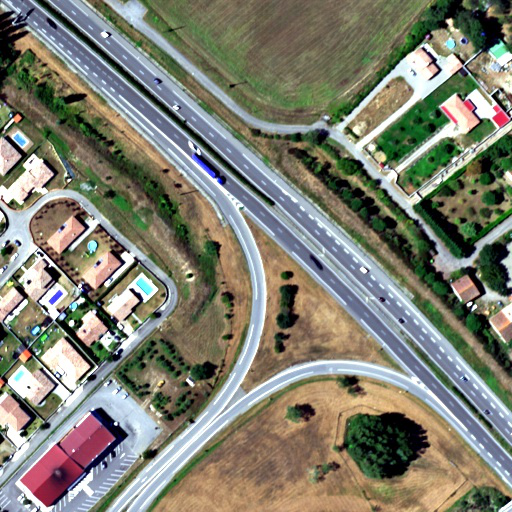
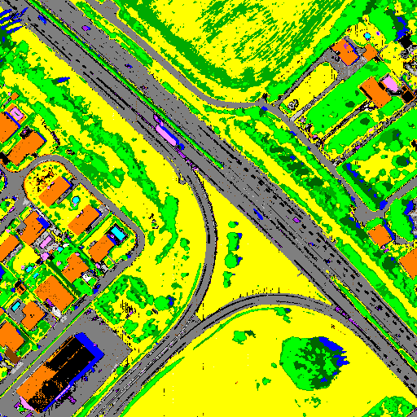

[Back to main page](index_NEW.md)

## Sensor : AISAFENIX

**Mauzac - suburban (France)  -  size: 512 x 512**

 |  | 
:-: | :-: | :-:
Color image | CHRIPS classification map | Regularized classification map

[AVIRIS-NG images](visu_images_AVIRIS_NG.md)

[HYSPEX images](visu_images_HYSPEX.md)

[HYMAP images](visu_images_HYMAP.md)

[PRISMA images](visu_images_PRISMA.md)

[FULL Images](visu_images_BIG_IMAGES.md)

[Back to main page](index.md)

