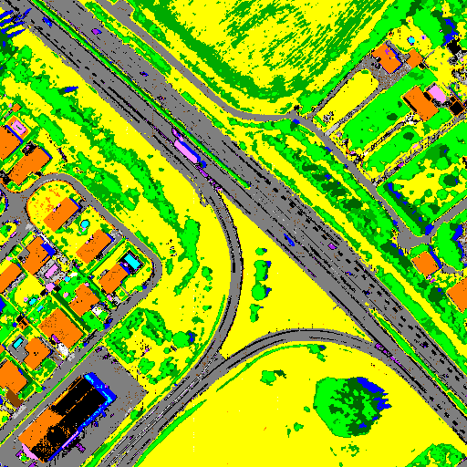
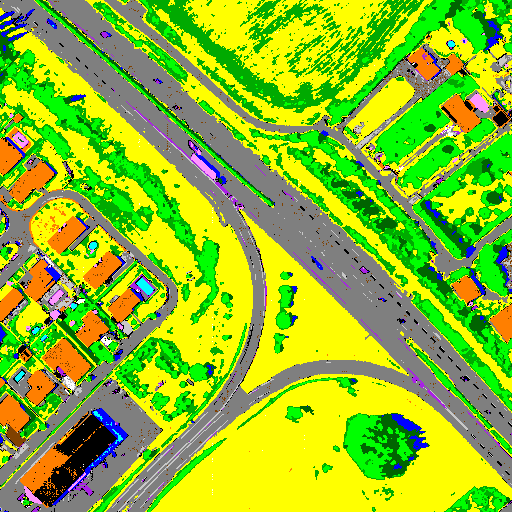

[Back to main page](index.md)

## Sensor : AISAFENIX

**Safe regularization**: use of CHRIPS parameters with slightly modified thresholds for all classes 

**Raw regularization**:  use of CHRIPS parameters with slightly modified thresholds for classes with specific absorptions and spectral angle similarity (2 degrees) for other classes 

**France, Mauzac - suburban  -  size: 512 x 512**

 |  | 
:-: | :-: | :-:
Hyperspectral image: color composite | Classification map with safe regularization | Classification map with raw regularization

 |  | 
:-: | :-: | :-:
Hyperspectral image: | Classification map  | Classification map 
:-: | :-: | :-:
color composite |  with safe regularization | with raw regularization

 |  | 
:-: | :-: | :-:
Classification map with safe regularization | Classification map with safe regularization | Classification map with raw regularization

 |  |  | 
:-: | :-: | :-: | :-:
roro | Hyperspectral image: color composite | Classification map with safe regularization | Classification map with raw regularization

 |  | 
:-: | :-: | :-:
aaa | bbb | ccc

[HYSPEX images](visu_images_HYSPEX.md)

[HYMAP images](visu_images_HYMAP.md)

[AVIRIS-NG images](visu_images_AVIRIS-NG.md)

[AVIRIS-NG FULL images](visu_images_BIG-IMAGE.md)

[PRISMA images](visu_images_PRISMA.md)

[Back to main page](index.md)

