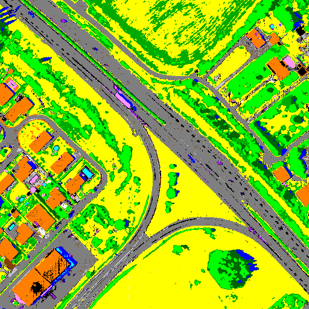

[Back to main page](index.md)

## Sensor : AISAFENIX

After CHRIPS processing, some pixels may be unclassified. A regularization process is then applied to try to classify them. A spatial constraint is applied: an unclassified pixel can be classified in a given class C if at least one pixel of its neighborhood, defined as a 5x5 square centered on P, belongs to the class C. Two types of regularization are proposed. 
**Safe regularization**: use of CHRIPS parameters with slightly modified thresholds for all classes 

**Raw regularization**:  use of CHRIPS parameters with slightly modified thresholds for classes with specific absorptions and spectral angle similarity (2 degrees) for other classes 

**France, Mauzac - suburban  -  size: 512 x 512**

 |  | 
:-: | :-: | :-:
&nbsp;&nbsp;Hyperspectral image: &nbsp;&nbsp;&nbsp; color composite | Classification map with safe regularization | Classification map with raw regularization

[HYSPEX images](visu_images_HYSPEX.md)

[HYMAP images](visu_images_HYMAP.md)

[AVIRIS-NG images](visu_images_AVIRIS-NG.md)

[AVIRIS-NG FULL images](visu_images_BIG-IMAGE.md)

[PRISMA images](visu_images_PRISMA.md)

[Back to main page](index.md)

