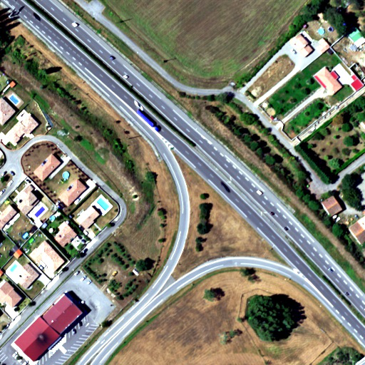
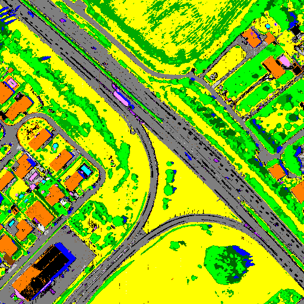
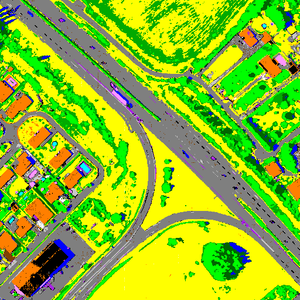

[Back to main page](index.md)

## Sensor : AisaFENIX

**Mauzac - suburban (France)  -  size: 512 x 512**

 |  | 
:-: | :-: | :-:
Color image | CHRIPS classification map | Regularized classification map

[Back to main page](index.md)

