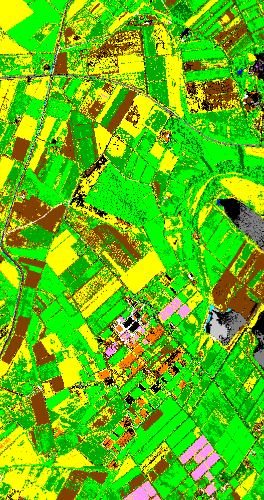

[Back to main page](index.md)

## Sensor : HYMAP

**Safe regularization**: use of CHRIPS parameters with slightly modified thresholds 
**Raw regularization**:  use of CHRIPS parameters with slightly modified thresholds for classes with absorptions and spectral angle similarity (2°) for other classes 

**France, Garons  -  size: 527 x 998**

 |  | 
:-: | :-: | :-:
Color image | Classification map with safe regularization | Classification map with raw regularization

[HYSPEX images](visu_images_HYSPEX.md)

[AISAFENIX images](visu_images_AISAFENIX.md)

[AVIRIS-NG images](visu_images_AVIRIS-NG.md)

[AVIRIS-NG FULL images](visu_images_BIG-IMAGE.md)

[PRISMA images](visu_images_PRISMA.md)

[Back to main page](index.md)

