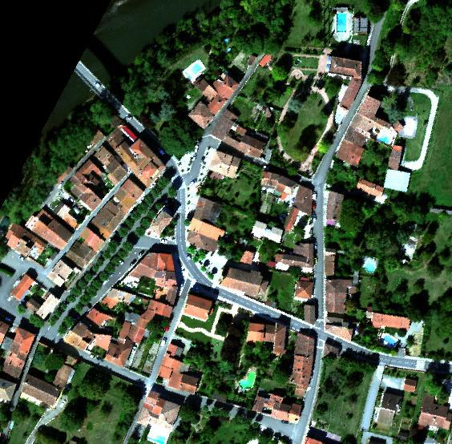
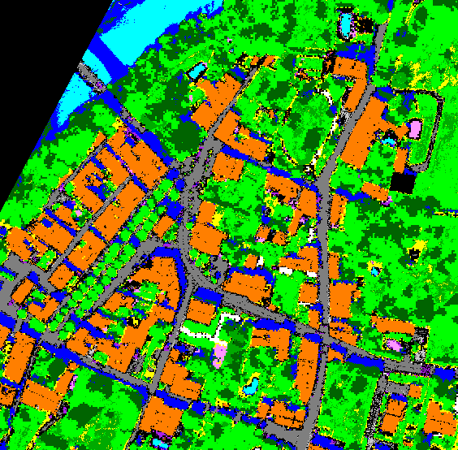
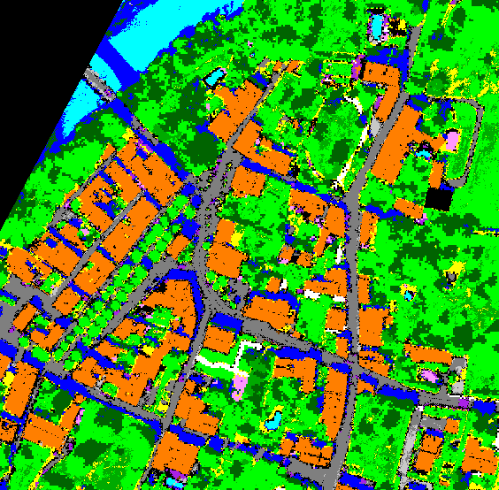
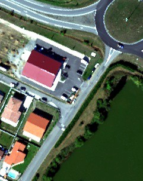
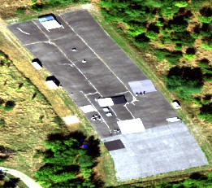

[Back to main page](index.md)

## Sensor : HYSPEX

**France, Mauzac  -  size: 564 x 554**

 |  | 
:-: | :-: | :-:
Color image | CHRIPS classification map | Regularized classification map

**France, Fauga  -  size: 1027 x 950**

 |  | 
:-: | :-: | :-:
Color image | CHRIPS classification map | Regularized classification map

**France, Fauga - town  -  size: 241 x 303**

 |  | 
:-: | :-: | :-:
Color image | CHRIPS classification map | Regularized classification map

**France, Fauga - Fermat  -  size: 261 x 231**

 |  | 
:-: | :-: | :-:
Color image | CHRIPS classification map | Regularized classification map

[AVIRIS-NG images](visu_images_AVIRIS_NG.md)

[AISAFENIX images](visu_images_AISAFENIX.md)

[HYMAP images](visu_images_HYMAP.md)

[PRISMA images](visu_images_PRISMA.md)

[FULL Images](visu_images_BIG_IMAGES.md)

[Back to main page](index.md)

