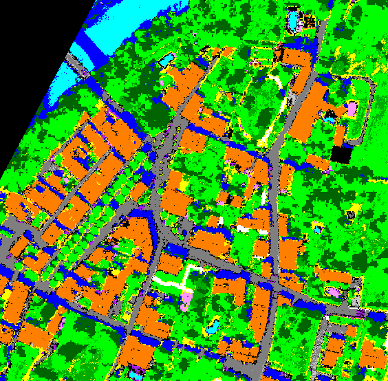
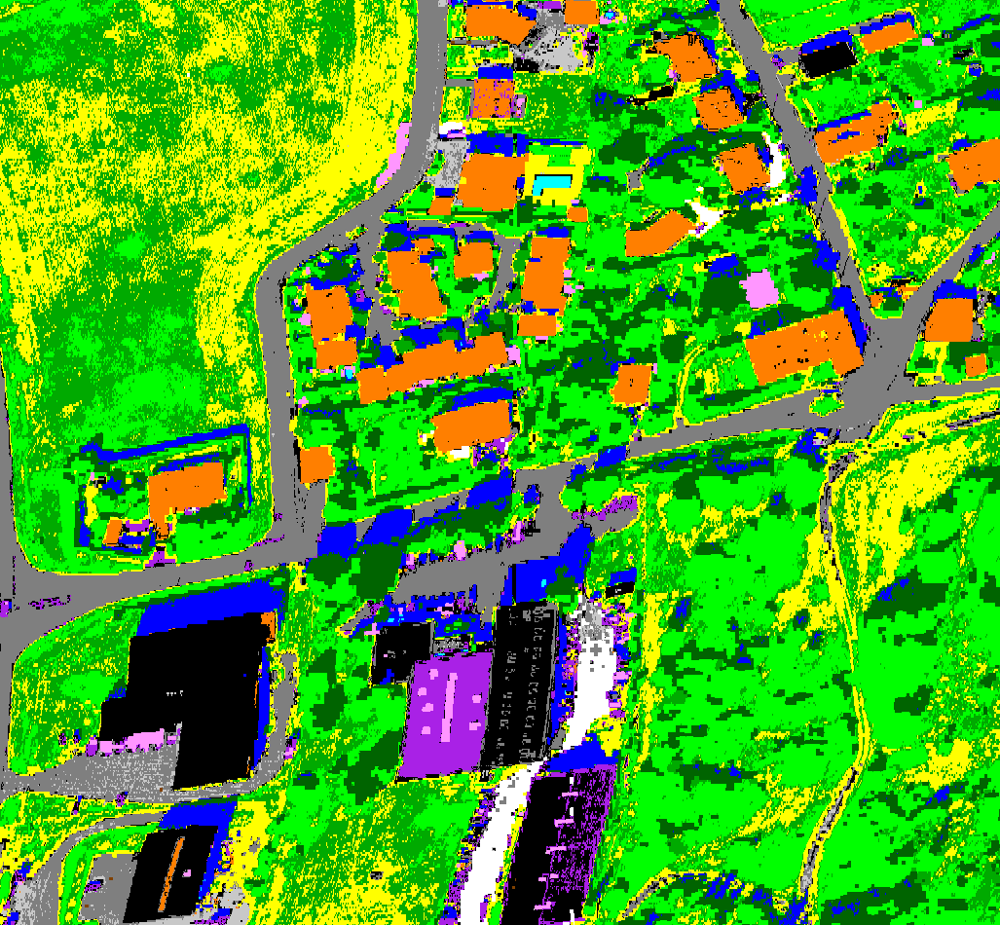
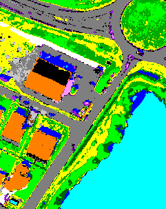
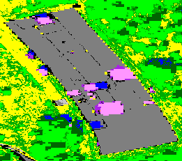

[Back to main page](index.md)

## Sensor : HYSPEX

**Regularization** 

After CHRIPS processing, some pixels may be unclassified. A regularization process is then applied to try to classify them. A spatial constraint is applied: an unclassified pixel can be classified in a given class C if at least one pixel of its neighborhood, defined as a 5x5 square centered on P, belongs to the class C. Two types of regularization are proposed. 

 - **Safe regularization**: use of CHRIPS parameters with slightly modified thresholds for all classes 

 - **Raw regularization**:  use of CHRIPS parameters with slightly modified thresholds for classes with specific absorptions and spectral angle similarity (2 degrees) for other classes 

**France, Mauzac  -  size: 564 x 554**

 |  | 
:-: | :-: | :-:
&nbsp;&nbsp;Hyperspectral image: &nbsp;&nbsp;&nbsp; color composite | Classification map with safe regularization | Classification map with raw regularization

**France, Fauga  -  size: 1027 x 950**

 |  | 
:-: | :-: | :-:
&nbsp;&nbsp;Hyperspectral image: &nbsp;&nbsp;&nbsp; color composite | Classification map with safe regularization | Classification map with raw regularization

**France, Fauga - town  -  size: 241 x 303**

 |  | 
:-: | :-: | :-:
&nbsp;&nbsp;Hyperspectral image: &nbsp;&nbsp;&nbsp; color composite | Classification map with safe regularization | Classification map with raw regularization

**France, Fauga - Fermat  -  size: 261 x 231**

 |  | 
:-: | :-: | :-:
&nbsp;&nbsp;Hyperspectral image: &nbsp;&nbsp;&nbsp; color composite | Classification map with safe regularization | Classification map with raw regularization

[AISAFENIX images](visu_images_AISAFENIX.md)

[HYMAP images](visu_images_HYMAP.md)

[AVIRIS-NG images](visu_images_AVIRIS-NG.md)

[AVIRIS-NG FULL images](visu_images_BIG-IMAGE.md)

[PRISMA images](visu_images_PRISMA.md)

[Back to main page](index.md)

