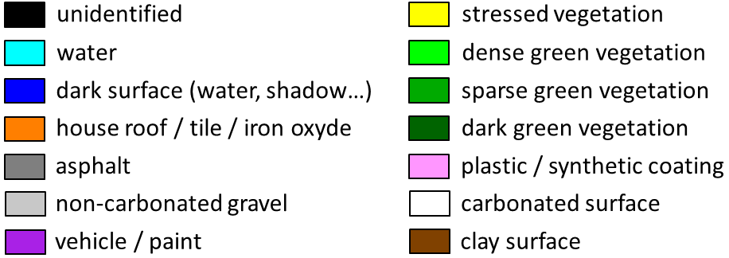

[main page](index.md)

## Sensor : HyMap

aaa | bbb | c
:-: | :-: | :-:
Color image | CHRIPS  | Regularized

**Garons (France)  -  size: 527 x 998**
 |  | 
:-: | :-: | :-:
Color image | CHRIPS classification map | Regularized classification map

[main page](index.md)

