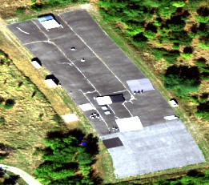
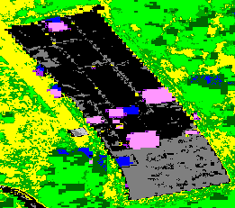
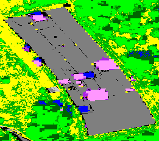
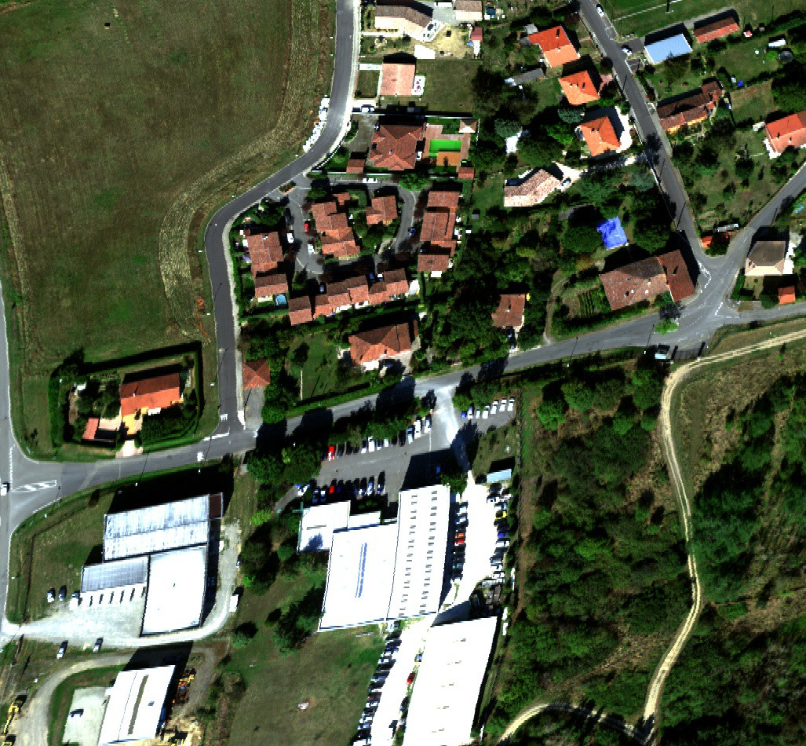
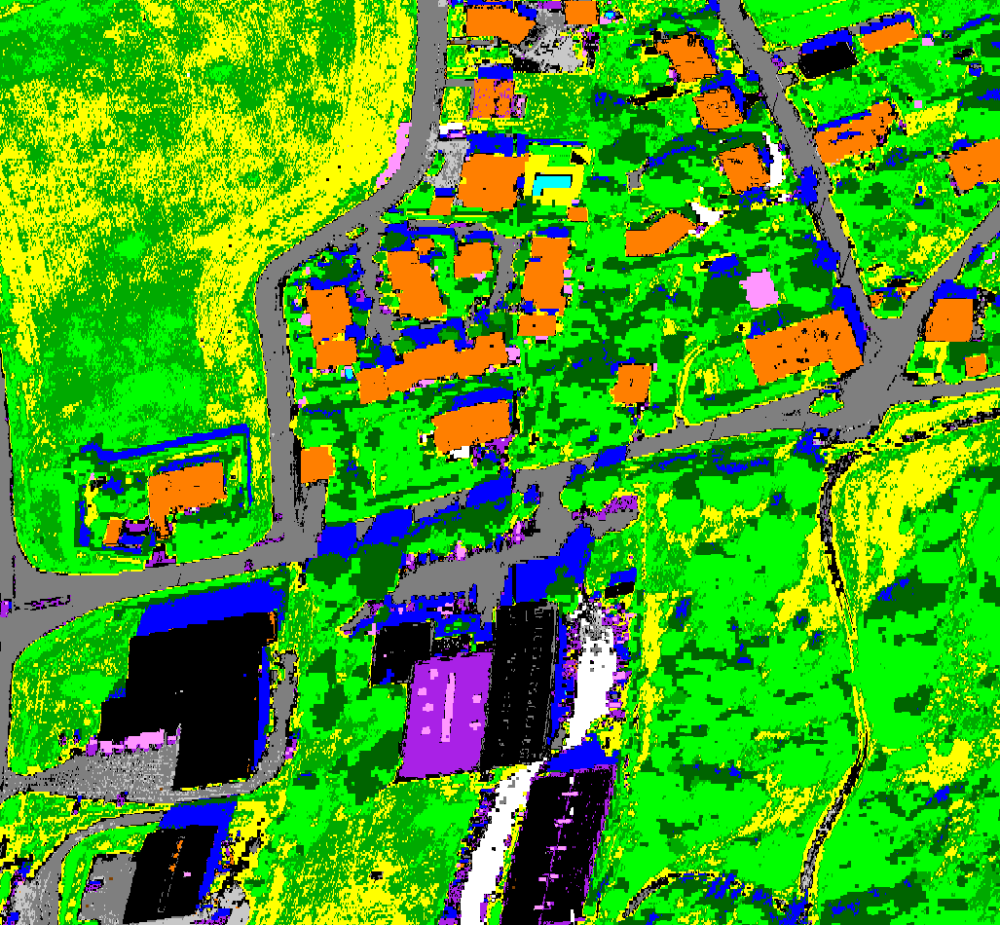
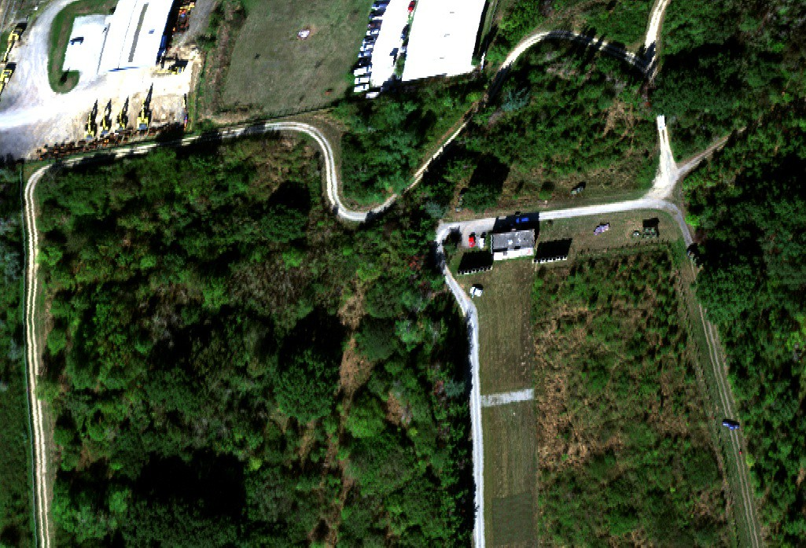
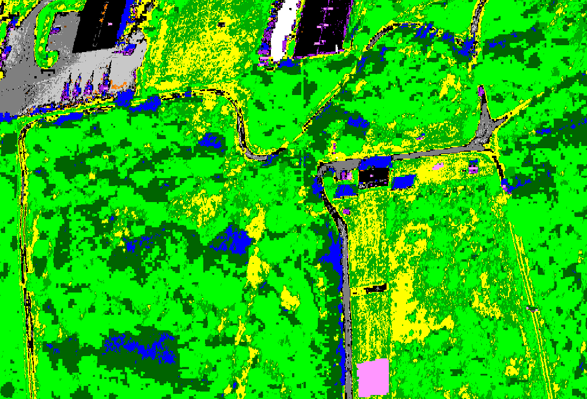
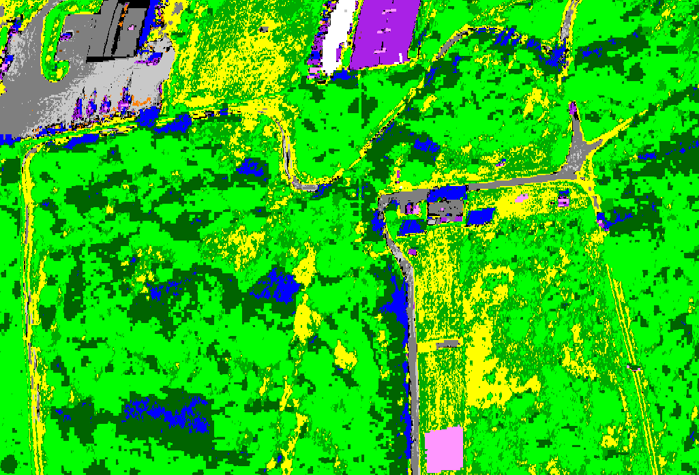
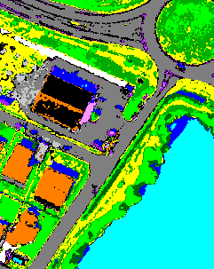
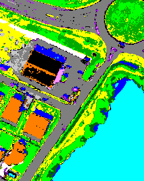

[main page](index.md)

## Sensor : Hyspex

**Mauzac (France) - ROI 0**
** Size : 261 x 231**
 |  | 
:-: | :-: | :-:
Color image | CHRIPS classification map | Regularized classification map

**Fauga (France) - ROI 0**
** Size : 1027 x 950**
 |  | 
:-: | :-: | :-:
Color image | CHRIPS classification map | Regularized classification map

**Fauga - town (France) - ROI 0**
** Size : 1025 x 697**
 |  | 
:-: | :-: | :-:
Color image | CHRIPS classification map | Regularized classification map

**Fermat - Fauga (France) - ROI 0**
** Size : 241 x 303**
 |  | 
:-: | :-: | :-:
Color image | CHRIPS classification map | Regularized classification map

[main page](index.md)

