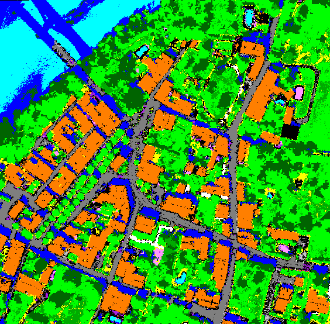
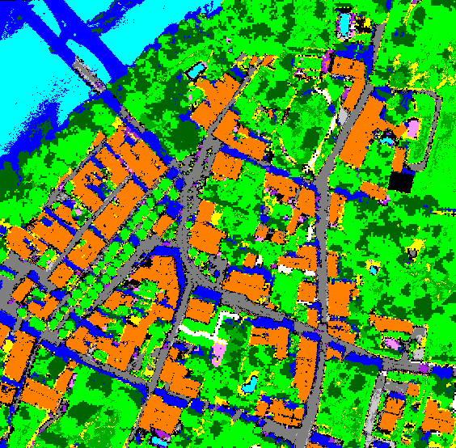
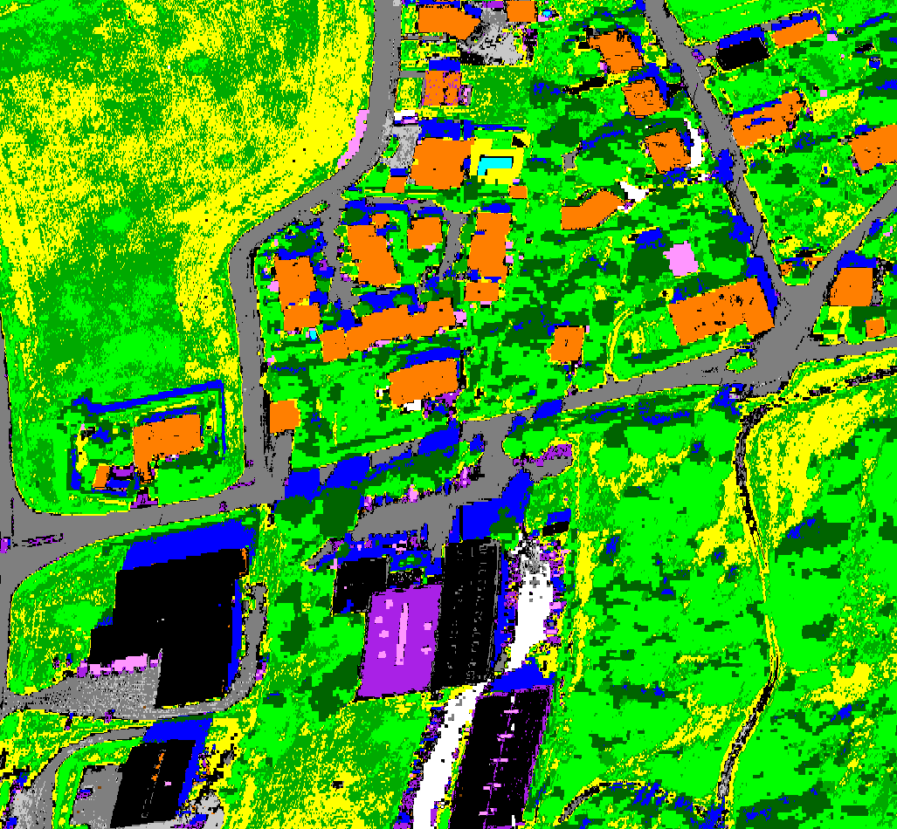
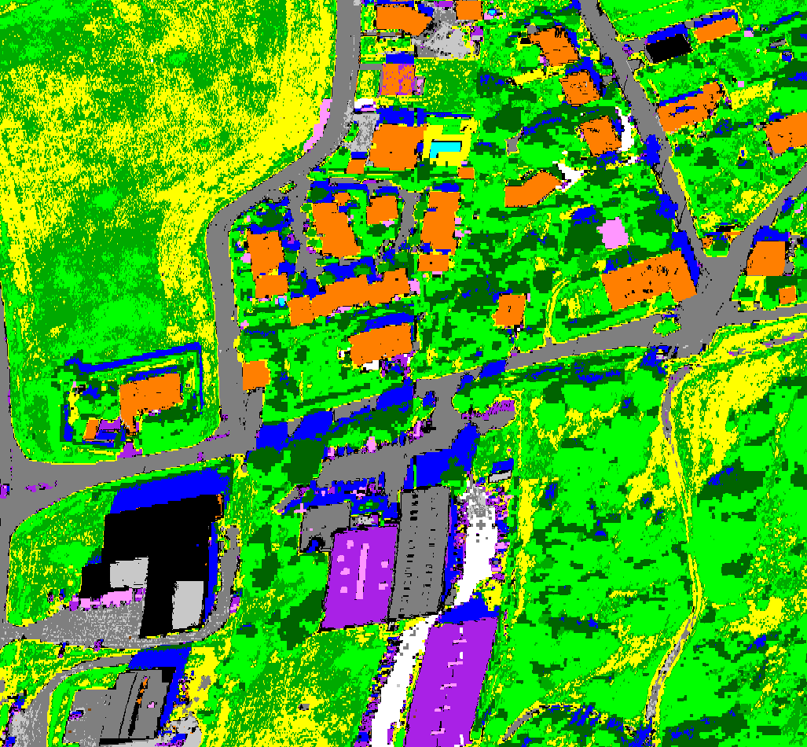
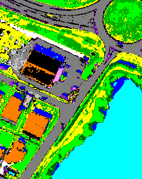

## Sensor : Hyspex

**Mauzac (564 x 554)**
 |  | 
:-: | :-: | :-:
Color image | CHRIPS classification map | Regularized classification map

**Fauga08_NORD (1027 x 950)**
 |  | 
:-: | :-: | :-:
Color image | CHRIPS classification map | Regularized classification map

**Fauga_town_denoised (241 x 303)**
 |  | 
:-: | :-: | :-:
Color image | CHRIPS classification map | Regularized classification map

**Fermat (261 x 231)**
 |  | 
:-: | :-: | :-:
Color image | CHRIPS classification map | Regularized classification map

