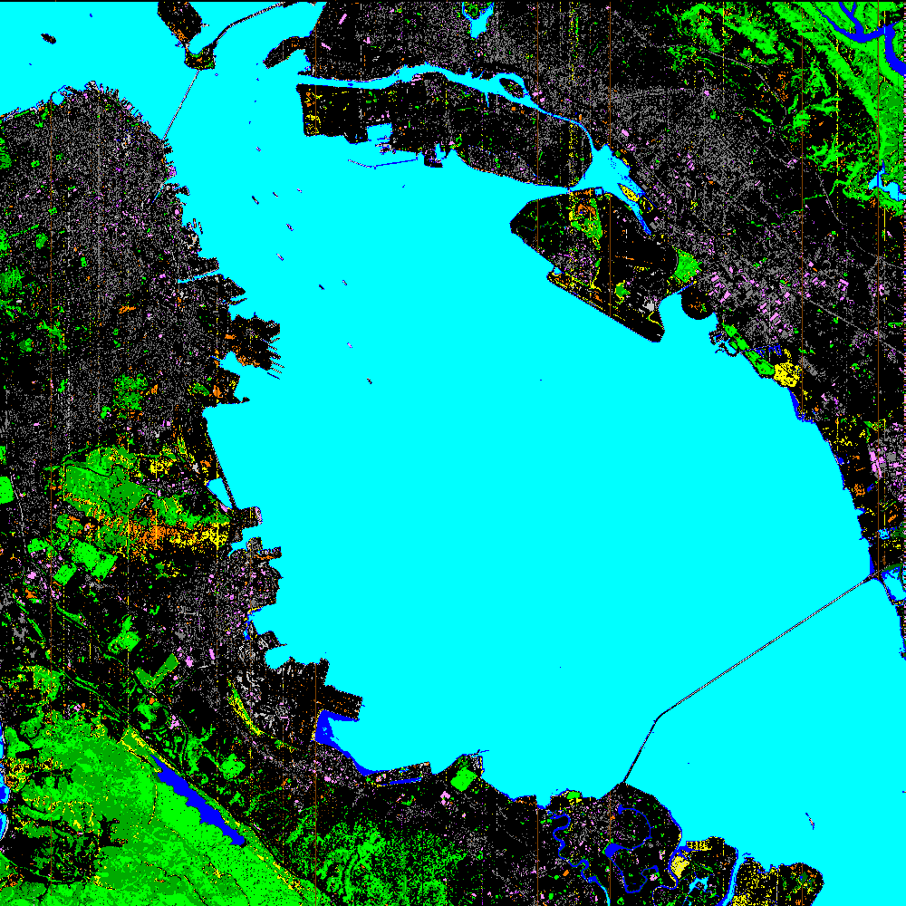
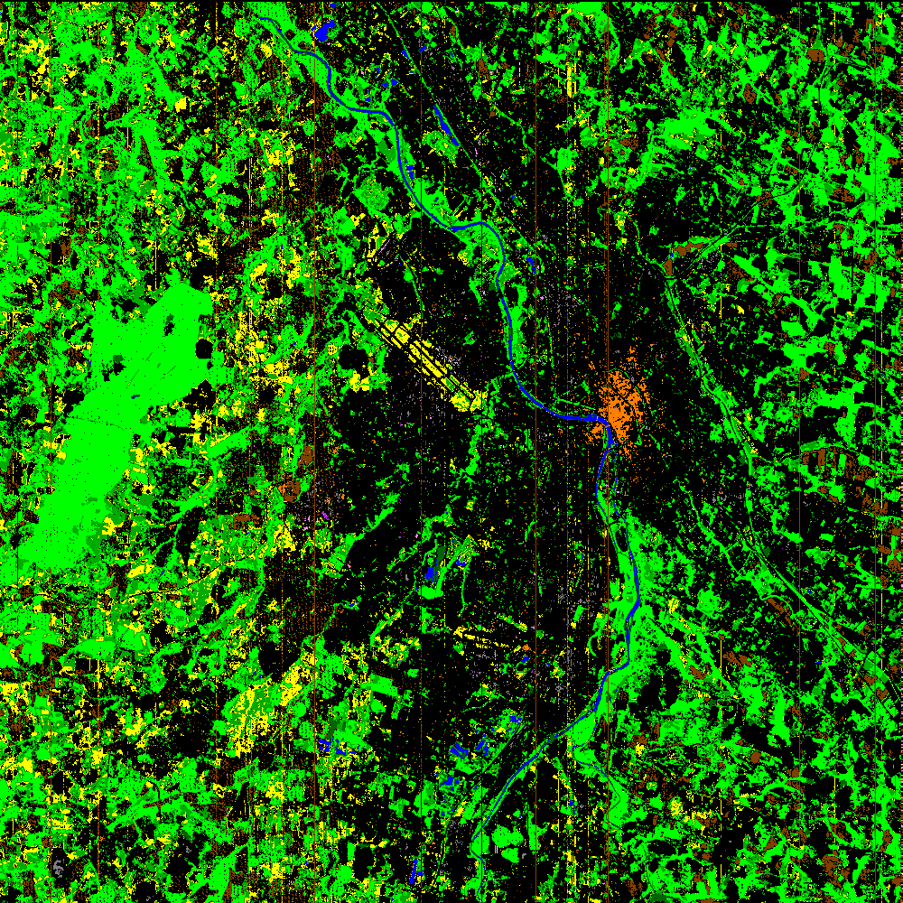
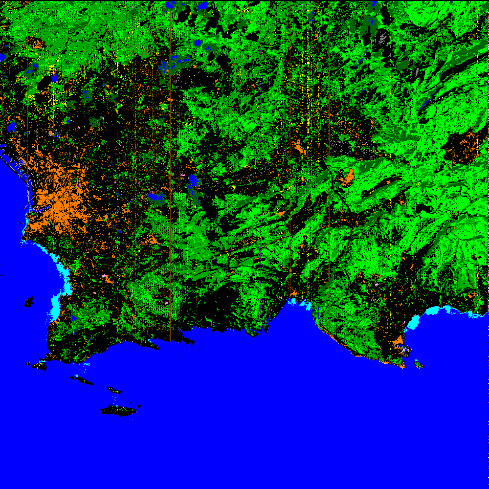
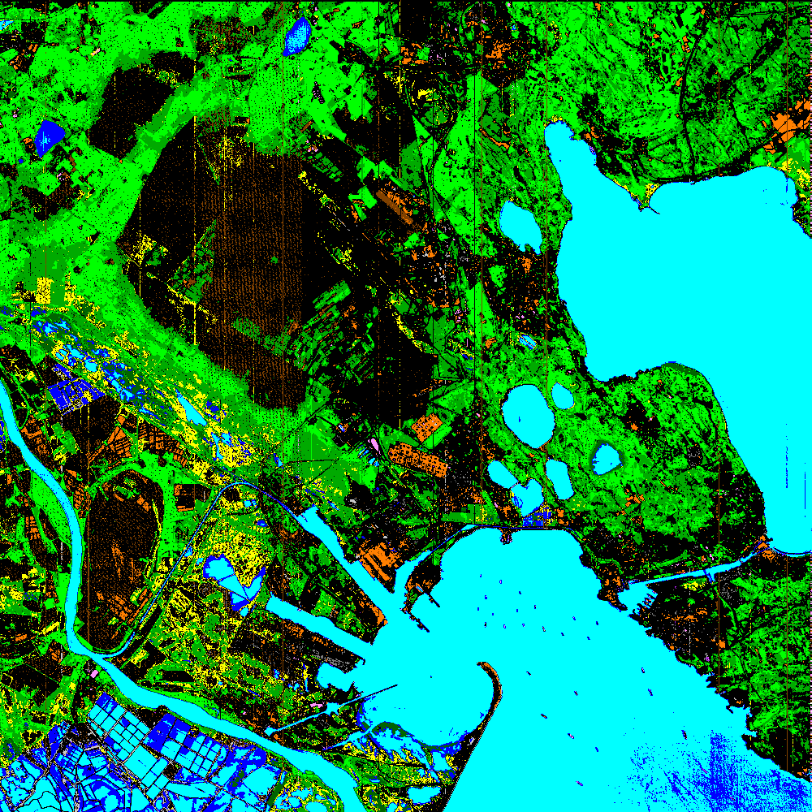
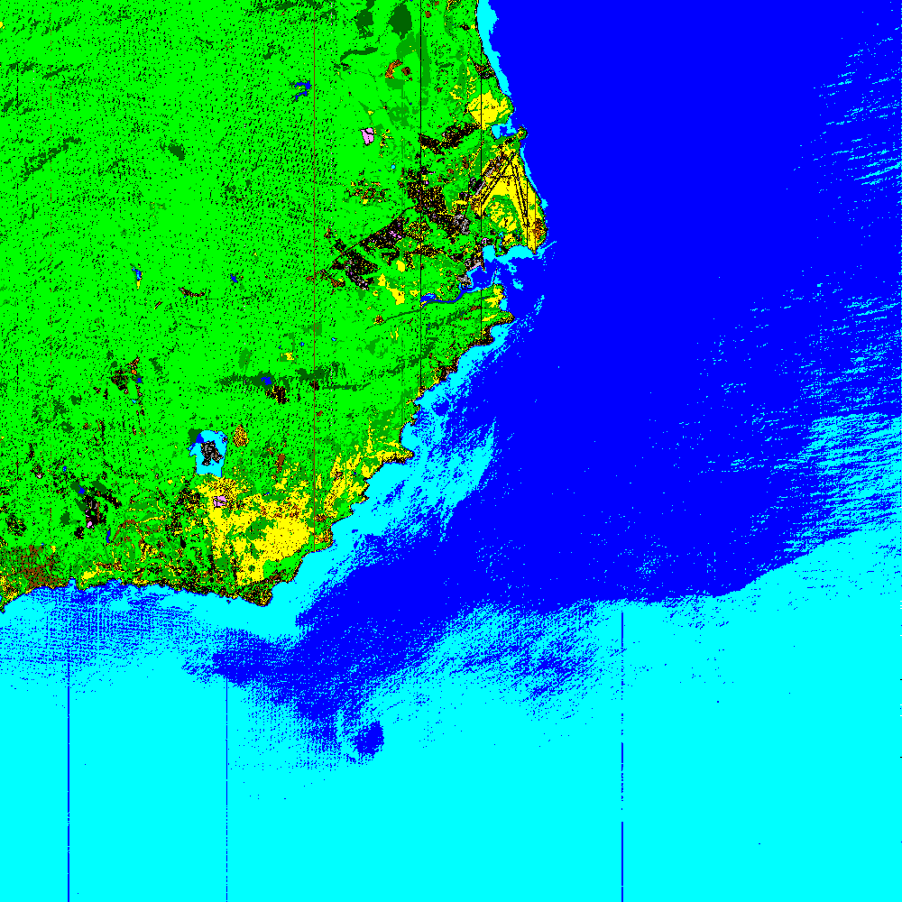

[Back to main page](index.md)

## Sensor : PRISMA

**USA, New York  -  size: 1000 x 1000**

 |  | 
:-: | :-: | :-:
Color image | CHRIPS classification map | Regularized classification map

**USA, San Francisco  -  size: 1000 x 1000**

 |  | 
:-: | :-: | :-:
Color image | CHRIPS classification map | Regularized classification map

**France, Toulouse  -  size: 1000 x 1000**

 |  | 
:-: | :-: | :-:
Color image | CHRIPS classification map | Regularized classification map

**France, Marseille  -  size: 1000 x 1000**

 |  | 
:-: | :-: | :-:
Color image | CHRIPS classification map | Regularized classification map

**France, Fos sur Mer  -  size: 1000 x 1000**

 |  | 
:-: | :-: | :-:
Color image | CHRIPS classification map | Regularized classification map

**Spain, Madrid  -  size: 1000 x 1000**

 |  | 
:-: | :-: | :-:
Color image | CHRIPS classification map | Regularized classification map

**Australia, somewhere  -  size: 1000 x 1000**

 |  | 
:-: | :-: | :-:
Color image | CHRIPS classification map | Regularized classification map

**Indonesia, Bali  -  size: 1000 x 1000**

 |  | 
:-: | :-: | :-:
Color image | CHRIPS classification map | Regularized classification map

**USA, Hawaii  -  size: 1000 x 1000**

 |  | 
:-: | :-: | :-:
Color image | CHRIPS classification map | Regularized classification map

**USA, Cuprite  -  size: 1000 x 1000**

 |  | 
:-: | :-: | :-:
Color image | CHRIPS classification map | Regularized classification map

[AVIRIS-NG images](visu_images_AVIRIS-NG.md)

[HYSPEX images](visu_images_HYSPEX.md)

[AISAFENIX images](visu_images_AISAFENIX.md)

[HYMAP images](visu_images_HYMAP.md)

[FULL Images](visu_images_BIG-IMAGE.md)

[Back to main page](index.md)

